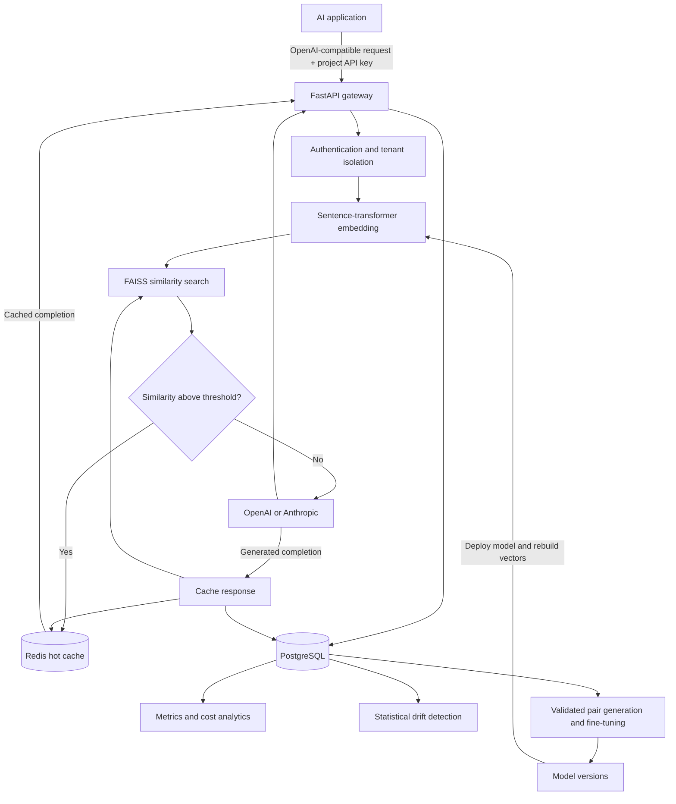

# DriftCache

**Semantic Caching Platform for LLM Systems**

DriftCache is an OpenAI-compatible API proxy that caches semantically similar LLM requests using sentence transformers and FAISS vector search. It reduces repeated API calls by recognizing paraphrased queries, while monitoring cache quality and semantic drift over time.

## Key Features

- **Semantic Caching** - Sentence Transformers + FAISS to recognize paraphrased queries beyond exact matches
- **OpenAI-Compatible Proxy** - Compatible with `/api/v1/chat/completions` and `/api/v1/models` endpoints
- **Dual Storage Architecture** - Redis for fast retrieval + PostgreSQL for analytics and persistence
- **Drift Detection** - Statistical monitoring (KS-test, Wasserstein distance) to detect query distribution changes
- **Fine-Tuning Pipeline** - PyTorch-based contrastive learning to adapt embeddings to domain-specific queries
- **Threshold Evaluation** - Offline utilities for comparing precision and recall at candidate thresholds

## Technology Stack

| Component | Technology |
|-----------|------------|
| Backend | FastAPI, Python 3.11, Pydantic |
| Frontend | React, TypeScript, Recharts, TailwindCSS |
| Caching | Redis 7, PostgreSQL 15 |
| Vector Search | FAISS, sentence-transformers (all-MiniLM-L6-v2) |
| ML Training | PyTorch 2.2, Sentence Transformers, Hugging Face |
| Drift Detection | SciPy (KS-test, Wasserstein), NumPy |
| LLM Providers | OpenAI GPT-4/4o-mini, Anthropic Claude |
| Infrastructure | Docker, Alembic, SQLAlchemy |


```

## High-Level Architecture



Redis serves cached responses, FAISS finds semantically similar prompts, and
PostgreSQL stores durable request, cache, provider, and model-version metadata.
On a miss, DriftCache forwards the request to the configured LLM provider and
stores the resulting response for later semantic reuse.

## Quick Start

```bash
# Clone and setup
git clone https://github.com/kavinsaravan/DriftCache.git
cd DriftCache
cp .env.example .env
# Configure environment variables in .env:
# - API_KEY: Bootstrap administrator key used to provision project keys
# - METRICS_API_KEY: Read-only key for dashboard (optional, recommended)
# - OPENAI_API_KEY or ANTHROPIC_API_KEY: For LLM provider

# Start with Docker
make up

# Open dashboard
open http://localhost
```

The root Makefile is the supported development interface:

```bash
make help
make test
make smoke
make demo DEMO_SCENARIO=semantic
make benchmark
```

Use `API_BASE_URL=https://your-host` for a remote API and export
`DRIFTCACHE_API_KEY` when authentication is enabled.

### Create a project key

Use the bootstrap `API_KEY` to create one isolated project credential for each
application integrating with DriftCache:

```bash
curl -X POST http://localhost:8000/api/v1/projects \
  -H "Authorization: Bearer $API_KEY" \
  -H "Content-Type: application/json" \
  -d '{"name":"Support assistant","key_name":"production"}'
```

The response contains a `dc_live_...` key exactly once. Store it in the client
application's secret manager as `DRIFTCACHE_API_KEY`. DriftCache stores only its
SHA-256 hash and derives the project's cache namespace from the verified key.
The bootstrap key can list projects, create additional keys, and revoke keys:

```text
GET    /api/v1/projects
POST   /api/v1/projects/{project_id}/keys
GET    /api/v1/projects/{project_id}/keys
DELETE /api/v1/projects/{project_id}/keys/{api_key_id}
```

**Security Note:** The dashboard uses `METRICS_API_KEY` (read-only) instead of the main `API_KEY`. This prevents write operations but still exposes:
- Cached prompts via `/metrics/top-cached-prompts`
- Performance data for any `tenant_id`

For single-user demos, embedding `METRICS_API_KEY` in the frontend is acceptable. For production multi-tenant deployments, implement server-side rendering or a backend proxy to keep all keys secure. Set both keys in your backend `.env` file.

## Integration Guide

DriftCache implements **OpenAI-compatible chat completions**, providing a proxy for LLM integrations. Just change your `base_url` to start caching responses and reducing costs.

### Quick Integration

#### Python (OpenAI SDK)

```python
import os
from openai import OpenAI

# Just point to DriftCache instead of OpenAI
client = OpenAI(
    base_url="http://localhost:8000/api/v1",
    api_key=os.environ["DRIFTCACHE_API_KEY"]
)

response = client.chat.completions.create(
    model="claude-sonnet-5",
    messages=[
        {"role": "user", "content": "What is machine learning?"}
    ]
)

print(response.choices[0].message.content)
print(f"Cache hit: {response.cache_hit}")  # Check if response was cached
```

#### JavaScript/TypeScript

```javascript
import OpenAI from 'openai';

const client = new OpenAI({
  baseURL: "http://localhost:8000/api/v1",
  apiKey: process.env.DRIFTCACHE_API_KEY
});

const response = await client.chat.completions.create({
  model: "claude-sonnet-5",
  messages: [
    { role: "user", content: "Explain quantum computing" }
  ]
});

console.log(response.choices[0].message.content);
console.log(`Cache hit: ${response.cache_hit}`);
```

#### cURL

```bash
curl http://localhost:8000/api/v1/chat/completions \
  -H "Content-Type: application/json" \
  -H "Authorization: Bearer your-api-key-here" \
  -d '{
    "model": "claude-sonnet-5",
    "messages": [
      {"role": "user", "content": "What is Python?"}
    ]
  }'
```

### Framework Integration

**Note:** These examples show using DriftCache as an external client. DriftCache does not depend on LangChain or LlamaIndex internally.

#### LangChain

```python
from langchain_openai import ChatOpenAI

llm = ChatOpenAI(
    base_url="http://localhost:8000/api/v1",
    model="claude-sonnet-5",
    api_key="your-api-key-here"
)

response = llm.invoke("Explain semantic caching")
print(response.content)
```

#### LlamaIndex

```python
from llama_index.llms.openai import OpenAI

llm = OpenAI(
    api_base="http://localhost:8000/api/v1",
    model="claude-sonnet-5",
    api_key="your-api-key-here"
)

response = llm.complete("What is vector search?")
print(response.text)
```

### Benefits

- **Reduce Costs**: Cache hits avoid LLM API calls (save ~$0.001-0.01 per request)
- **Improve Latency**: Cached responses return in ~50ms vs 2-5 seconds for LLM calls
- **Semantic Matching**: Paraphrased queries hit the same cache (not just exact matches)
- **OpenAI Compatible**: Works with any tool/framework that supports OpenAI API


## How It Works

```
Request → Embed prompt → FAISS search → Similarity ≥ threshold?
                                              ↓
                                    Yes: Return from Redis/cache
                                    No:  Call LLM → Store response
```

**Core Flow:**
1. Incoming request is embedded using Sentence Transformers (384-dim vectors)
2. FAISS performs k-NN search against cached prompt embeddings
3. If similarity score ≥ threshold (default 0.85), retrieve from Redis
4. Otherwise, forward to LLM provider and cache the response
5. All decisions are logged to PostgreSQL for analytics and drift detection

**Analysis Pipeline:**
- Drift detector monitors similarity score distributions using KS-test and Wasserstein distance
- Threshold evaluation utilities compare candidate thresholds on historical cache decisions
- Fine-tuning trainer uses contrastive learning on cached query pairs to improve domain-specific matching

## API Endpoints

**Core Caching:**
```bash
POST /api/v1/chat/completions      # OpenAI-compatible chat
GET  /api/v1/models                # List models
```

**Fine-Tuning (Experimental):**
```bash
POST /api/v1/training/collect-data        # Collect training pairs from cache
POST /api/v1/training/jobs                # Start fine-tuning job
GET  /api/v1/training/jobs/{job_id}       # Monitor training progress
POST /api/v1/training/models/{version_id}/deploy
GET  /api/v1/training/stats               # Training statistics
```

**Monitoring:**
```bash
GET  /api/v1/metrics/summary       # Hit rate, latency, cost savings
GET  /api/v1/drift/latest          # Latest drift alert
GET  /api/v1/benchmark/summary     # Benchmark results
```

## Fine-Tuning Pipeline

**End-to-End ML Infrastructure:**

DriftCache includes an experimental end-to-end pipeline to adapt the embedding model to your domain:

**1. Training Data Collection**
```bash
POST /api/v1/training/collect-data
```
- Generates positive pairs based on embedding similarity scores
- Generates hard negatives (medium similarity, shouldn't match)
- Generates easy negatives (random dissimilar queries)

**2. PyTorch Training**
```bash
POST /api/v1/training/jobs
```
- Contrastive learning with Multiple Negatives Ranking Loss
- Learning rate warmup and checkpoint management
- Configurable hyperparameters (batch size, epochs, learning rate)

**3. Model Evaluation**
- Held-out validation split
- Pair-classification accuracy, precision, recall, and F1
- Positive/negative similarity averages and mean squared error

**4. Hugging Face Integration**
- Upload models to Hugging Face Hub
- Register completed models and their validation metrics in PostgreSQL
- Deploy a model with a full FAISS re-embedding and runtime cutover
- Easy sharing and collaboration

See [the training module guide](backend/app/training/README.md) for configuration and deployment details.

## Drift Detection

DriftCache monitors semantic distribution changes using statistical methods:

**Detection Method:**
- Compares recent cache similarity scores against a reference baseline
- Uses multiple statistical tests:
  - **Kolmogorov-Smirnov test**: Detects distribution shifts (p-value threshold)
  - **Wasserstein distance**: Measures how far distributions have moved
  - **Mean shift**: Tracks average similarity score changes
  - **Variance ratio**: Monitors spread changes in similarity scores
- Requires minimum sample sizes (50 reference, 30 recent) for reliable detection

**Output:**
- Drift severity classification (no_drift, moderate_drift, high_drift)
- Statistical metrics and confidence levels
- Drift alert logging to PostgreSQL for historical analysis

Access via `GET /api/v1/drift/latest` to view current drift status.


## Performance Metrics

Evaluation results on 140 labeled test pairs (semantic duplicates + hard negatives):

| Similarity Threshold | Precision | Recall | F1 Score | Use Case |
|---------------------|-----------|--------|----------|----------|
| **0.85** (Balanced) | **97.5%** | **55.7%** | **70.9%** | Production default - high safety with good coverage |
| **0.90** (Conservative) | **100%** | **31.4%** | **47.8%** | Maximum safety - zero wrong answers |
| 0.92 | 100% | 20.0% | 33.3% | Ultra-conservative |
| 0.95 | 100% | 5.7% | 10.8% | Near-exact match only |

**Key Insights:**
- **Precision**: Accuracy of cache hits (% of cached responses that are correct)
- **Recall**: Coverage (% of matching pairs successfully cached at this threshold)
- **Trade-off**: Higher thresholds = safer but less coverage; lower thresholds = more coverage but higher risk
- **Testing method**: Pair-wise similarity on labeled data (not full cache simulation)

At 0.85, precision of 97.5% means 1 questionable hit out of 40 on this test set.
